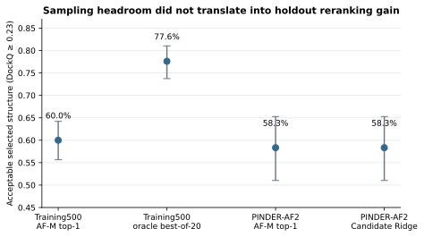
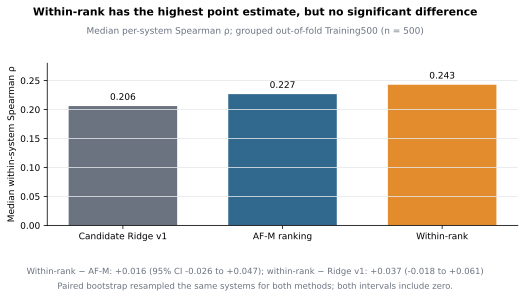
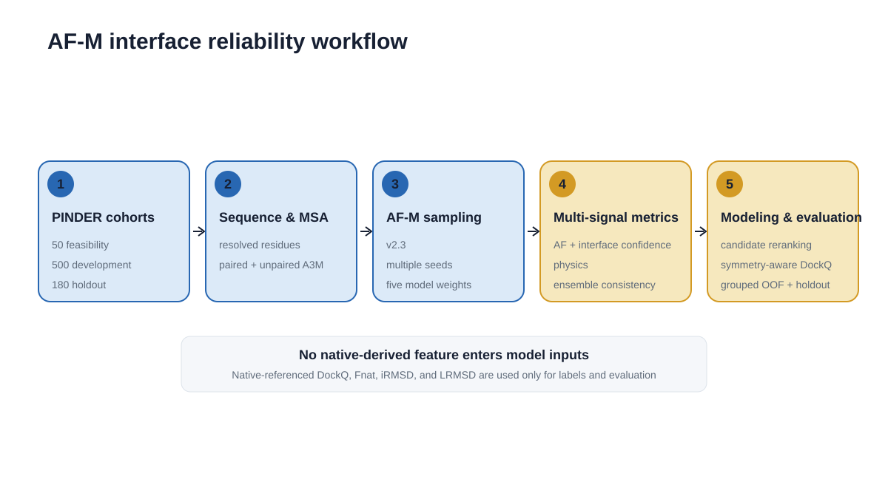

# AFM Interface Reliability

A research project on the reliability of AlphaFold-Multimer
(AF-M) protein–protein interface predictions. The central question is simple:
when AF-M generates 20 candidates for one protein pair, can a small,
interpretable model choose a better structure than AF-M's own ranking?

## Current result

This repository documents the current stage of an ongoing project. Across the
evaluated rerankers, there is **no statistically significant improvement in the
primary top-1 selection endpoint**. On the 180-system PINDER-AF2 holdout, AF-M
rank-1 and the five-feature Candidate Ridge v1 model both selected an acceptable
structure (`DockQ >= 0.23`) for `58.33%` of systems. Mean DockQ changed from
`0.45240` to `0.45385`; the paired difference was `+0.00145` (95% bootstrap CI
`-0.00129` to `+0.00472`). The pooled candidate-level ROC-AUC was high (`0.934`),
but this mostly reflects discrimination across systems and did not translate
into better selection among the 20 candidates of one system.

Two within-system follow-ups leave that conclusion unchanged. A quantile-rank
variant (`candidate_ridge_v1_within_rank`) increased the Training500
out-of-fold median within-system Spearman from `0.227` for AF-M ranking and
`0.206` for Candidate Ridge v1 to `0.243`, but the paired confidence intervals
included zero. It selected 106/180 acceptable holdout structures, one more than
AF-M and v1, while the 95% CI for the acceptable-rate difference still included
zero. A conditional-logit group-softmax variant selected 105/180, the same as
AF-M, and likewise showed no significant top-1 improvement.

There is nevertheless a limited, exploratory signal at the top of the list. In
the 88 outcome-defined rerank-rescuable Training500 systems, the mean rank of
the first acceptable candidate changed from `7.51` under AF-M ranking to `7.08`
with within-system ranks and `7.32` with group-softmax; recall@3 changed from
`23.9%` to `34.1%` and `30.7%`. Median rank remained 6 and recall@5 did not
improve, so this is evidence of modest, metric-dependent front-of-list
enrichment, not a demonstrated general improvement in ranking or AF-M
accuracy. The corresponding holdout subset contains only 12 systems and is
treated as descriptive.



The corresponding within-system result is shown separately below. The
within-rank point estimate is higher, but both paired confidence intervals
cross zero; it is therefore a promising direction to test, not a demonstrated
ranking improvement. Here, *paired* means that each bootstrap replicate
resampled the same system IDs for both methods before subtracting their cohort
median Spearman values.



Training500 shows why the problem is worth studying: AF-M top-1 was acceptable
for **60.0%** of systems, while a retrospective best-of-20 oracle reached
**77.6%**. The gap is sampling headroom, not evidence that the current model can
recover it.

A core secondary finding is that ensemble consistency is a reproducible
**system-level trust signal**, not a candidate-selection signal. Contact-map
consistency correlated with the fraction of acceptable candidates at `0.655`
on Training500 and `0.800` on PINDER-AF2, and with rank-1 acceptability at
`0.437` and `0.737`. More consistent ensembles are therefore usually more
trustworthy. They are not guaranteed to be correct: 17 Training500 systems and
4 holdout systems were highly consistent even though all 20 candidates were
wrong. See [Consistency](docs/CONSISTENCY.md).

## Planned follow-ups

The next stage separates two decisions that require different signals:

An exploratory Training500 cluster diagnostic provides the motivation. In the
88 rerank-rescuable systems, the 20 candidates formed a median of 7.5 contact
clusters, and the dominant acceptable cluster had median purity 1.00. Yet that
cluster had median rank 2.5 by cluster-mean ipTM, and the top-ipTM cluster was
entirely wrong in 84% of these systems. Tested consistency interactions and
hand-built cluster gates were net negative or tied overall. These post-hoc
results suggest that acceptable candidates are strongly cluster-structured but
often not the highest-confidence cluster; they motivate signals beyond the
current scalar AF-M/PAE summaries. See the exploratory
[`pairwise_consistency_diagnostic.py`](analysis/pairwise_consistency_diagnostic.py).

- **System-level trust and sampling.** Use ensemble consistency to decide when
  AF-M rank-1 is trustworthy and when a system needs additional sampling or a
  changed MSA/modeling strategy. Consistency cannot distinguish a sampled-but-
  misranked system from one in which every sampled candidate is wrong.
- **Candidate-level ranking.** Add paired-MSA coevolution features and richer,
  candidate-specific inter-chain PAE representations, then compare pairwise and
  listwise objectives with group-softmax. The current model already uses
  PAE-derived summaries (`pDockQ2-min`, `iLIS`, and `ipSAE`); the planned change
  is to exploit residue-pair distributions, low-PAE regions, asymmetry, and
  candidate-relative information rather than to introduce PAE for the first
  time.
- **Ranking-focused evaluation.** Track first-acceptable rank, MRR, recall@1/3/5,
  within-system Spearman, and top-1 acceptable rate. Training500 grouped
  out-of-fold results remain developmental. Because PINDER-AF2 has now been
  inspected for several follow-ups, a new untouched test cohort is preferable
  for future confirmatory claims.

## Study design

| Cohort | Purpose | Systems | Candidates per system |
| --- | --- | ---: | ---: |
| Feasibility50 | Pipeline checks | 50 | 25 |
| Training500 | Stratified development and grouped validation | 500 | 20 |
| PINDER-AF2 | Held-out evaluation | 180 | 20 |

Candidate Ridge uses five native-independent inputs: full-precision ipTM, pTM,
pDockQ2-min, iLIS, and ipSAE. All 20 candidates from a protein pair remain in
the same development fold. DockQ is used only as a label and evaluation metric.

The workflow diagram below is a fixed schematic overview; the four
quantitative SVGs in `figures/` are regenerated from committed tables by
`scripts/figures/make_figures.py`.



## Reproduce the public analysis

The repository includes the two derived candidate-level tables needed to
retrain and evaluate the baseline. A separate path-free candidate-pair table
supports the exploratory consistency and cluster diagnostic; it is not required
for baseline reproduction. The repository does not include native structures,
predicted PDBs, MSAs, AlphaFold parameters, or PAE JSON files.

```bash
conda env create -f environment.yml
conda run -n afm-interface-reliability python -m unittest discover -s tests -v
conda run -n afm-interface-reliability python scripts/validate_repository.py
conda run -n afm-interface-reliability python scripts/reproduce_level2.py
```

The last command retrains the model, predicts the held-out candidates, evaluates
both selectors, and regenerates all four data figures in `reproduced/`. It runs
on CPU and refuses to overwrite a non-empty output directory unless
`--overwrite` is supplied. The within-rank panels are regenerated from the
committed follow-up selector and bootstrap-summary tables; this command does not
retrain that follow-up model.

## Scientific safeguards

- **Held-out evaluation:** features, preprocessing, coefficients, threshold, and
  selection rule were fixed before evaluation on PINDER-AF2.
- **No native leakage into inputs:** DockQ, Fnat, interface RMSD, ligand RMSD,
  and other native-derived values are labels or evaluation outputs only.
- **Grouped validation:** candidates from one system are never split across
  development folds.
- **Chain assignment audit:** chain swapping is allowed only when both chains
  have the same known accession. Missing tokens such as `UNDEFINED` do not
  establish symmetry. Correcting this changed continuous DockQ for 130
  Training500 and 299 holdout rows, but changed no `DockQ >= 0.23` class.
- **Split audit:** exact system, PDB, interface-cluster, and unordered
  chain-cluster-pair overlap counts are all zero. One known UniProt-pair overlap
  was found. Excluding that holdout system leaves the conclusion unchanged
  (58.66% vs 58.66%; mean-DockQ difference `+0.00146`).
- **Paired inference:** selector comparisons resample complete protein-pair
  systems, not individual candidate rows.

## Repository map

```text
analysis/          Statistical analysis used for Training500
configs/           Frozen cohort records and model configuration
docs/              Methods, results, limitations, data notes, references
figures/           One workflow diagram and four generated SVG figures
results/data/      Public derived candidate tables and manifests
results/audits/    Chain-assignment and split-overlap audits
results/ml/        Frozen model, predictions, and evaluation evidence
scripts/           Data preparation, metrics, modeling, figures, validation
tests/             Unit and integration-style tests
third_party/       Pinned metric implementations and upstream licenses
```

Start with [Methods](docs/METHODS.md), [Results](docs/RESULTS.md),
[Limitations](docs/LIMITATIONS.md), and [Data](docs/DATA.md). Exact values are
stored in machine-readable JSON and CSV files under `results/`.

## About the author

This repository is my undergraduate research project in computational
structural biology. I built the pipeline end to end: cohort selection, the
full-precision ColabFold wrapper, the metric adapters, the Training500
analysis, and the Candidate Ridge baseline, together with the tests and this
documentation.

Two decisions here came directly from problems I hit while running the
experiments. ColabFold rounds ipTM and pTM in its default JSON output, which
silently breaks joint ranking of candidates, so the wrapper captures the
full-precision values before that rounding. And the original DockQ chain-swap
rule compared accession strings literally, which treated `UNDEFINED ==
UNDEFINED` as homodimer evidence; the correction is documented under
`results/audits/chain_exchange/`.

## Data, citation, and license

The study uses the public PINDER 2024-02 release. Project-authored code is MIT
licensed; PINDER-derived records and all upstream assets remain subject to their
original attribution and terms. See [Data](docs/DATA.md),
[References](docs/REFERENCES.md), [CITATION.cff](CITATION.cff), and the vendored
licenses under `third_party/`.
